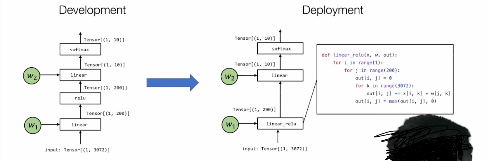

# 机器学习编译

### 一、概述

1、什么是机器学习编译？

将一个机器学习模型从开发形态转化到部署形态。`MLC（Machine learning compilation）!`

类比Linux嵌入式开发中的交叉编译

2、机器学习编译的目标？

- 集成与最小化依赖
- 利用原生硬件加速
- 优化（空间优化、运行效率、扩展到多机多卡异构节点等）

3、核心元素

- 张量（多维数组）
- 张量函数（输入->输出）
- 抽象（计算图、张量程序、算子库和运行时、硬件）

**`张量函数在不同抽象形式下的相关变换`**

